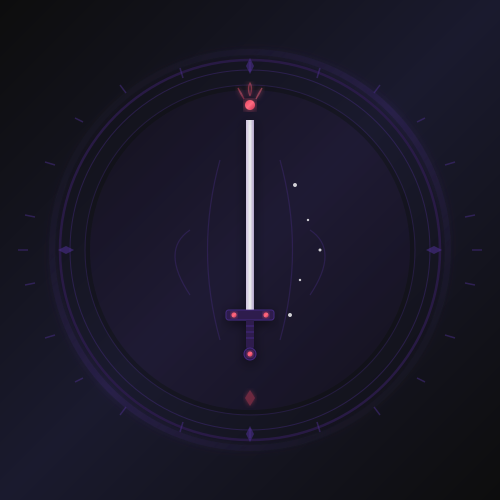

  
  <h2>🎨 Brand Shadowbound</h2>
  
Identità visiva, colori, tipografia e linee guida del marchio

  

    <h3>🎯 Brand Identity</h3>
    
Vision, valori, personalità e missione del brand Shadowbound

    <a href="../brand/brand-identity" class="lnk">Leggi →</a>
  

  

    <h3>🎨 Palette Colori</h3>
    
Palette ufficiale con codici HEX, RGB e CMYK

    <a href="../brand/color-palette" class="lnk">Leggi →</a>
  

  

    <h3>✒️ Tipografia</h3>
    
Font ufficiali, gerarchia tipografica e linee guida

    <a href="../brand/typography" class="lnk">Leggi →</a>
  

  

    <h3>🖼️ Specifiche Logo</h3>
    
Specifiche tecniche per l'uso del logo Shadowbound

    <a href="../brand/logo-specifications" class="lnk">Leggi →</a>
  

  

    <h3>🤖 AI Logo Prompts</h3>
    
Prompt per generare il logo con strumenti AI

    <a href="../brand/ai-logo-prompts" class="lnk">Leggi →</a>
  

  

    <h3>🖌️ Logo Placeholder</h3>
    
SVG placeholder del logo in formato vettoriale

    <a href="../brand/logo-placeholder.svg" class="lnk">Scarica SVG →</a>
  

  <a href="../">🏠 Dashboard</a> • <a href="../forum/">💬 Forum</a> • <a href="../admin/">🛠️ Admin</a>

